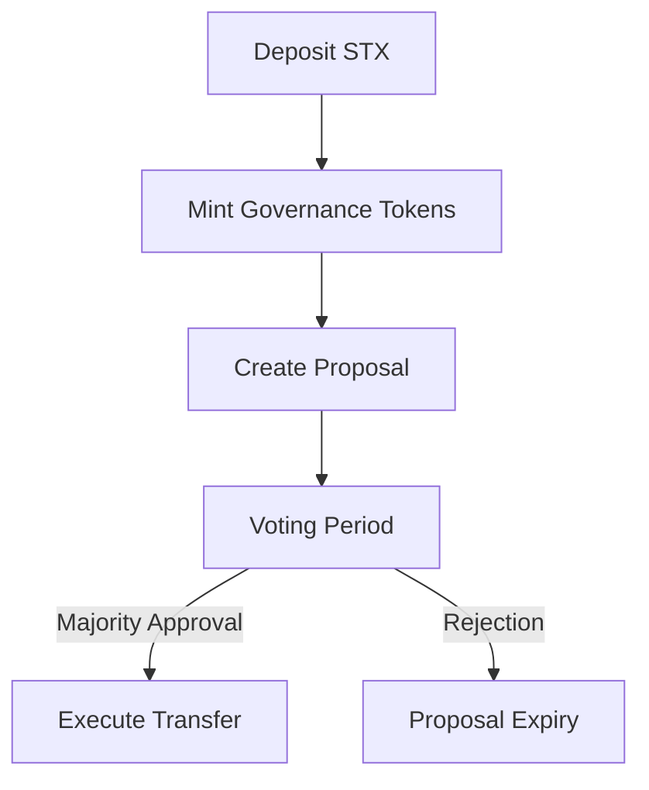

# Stacks Governance Protocol (SGP) Smart Contract

[](https://docs.stacks.co/docs/clarity/)

A Bitcoin-anchored decentralized governance system for transparent treasury management on Stacks Layer 2.

## Overview

The Stacks Governance Protocol enables community-controlled asset management through:

- Time-locked STX deposits
- Proposal-based funding requests
- Token-weighted voting system
- Bitcoin-block anchored execution
- Regulatory-compliant governance tracking

## Key Features

### Institutional-Grade Security

- 144-block (24h) minimum voting duration
- 20,160-block (14-day) maximum proposal lifespan
- STX-denominated governance tokens
- Withdrawal lock periods (1440 blocks/~10 days)

### Treasury Management

- Minimum deposit requirement (1,000,000 µSTX)
- Proposal amount validation
- Direct STX transfers to approved targets
- Real-time supply tracking

### Governance Engine

- Immutable vote recording
- Double-spend protected voting
- Transparent proposal lifecycle
- Automatic vote tallying
- Execution deadline enforcement

## Technical Specifications

| Category       | Detail                 |
| -------------- | ---------------------- |
| Language       | Clarity 2.0            |
| Dependencies   | None                   |
| Network        | Stacks Mainnet/Testnet |
| Compliance     | SIP-009, SIP-019       |
| Token Standard | Native STX wrapper     |

## Installation

```bash
git clone https://github.com/nathaniel-cmd/stacks-governance.git
cd stacks-governance
```

## Core Functionality

### 1. Deposit System

- `deposit(amount)` - Lock STX to mint governance tokens
- `withdraw(amount)` - Burn tokens to reclaim STX post-lock period

### 2. Governance Process

1. **Proposal Creation**

   - `create-proposal(description, amount, target, duration)`
   - Minimum 1-day voting period
   - STX-denominated funding requests

2. **Voting Mechanism**

   - `vote(proposal-id, vote-for)`
   - Token-weighted votes
   - Anti-duplicate voting protection

3. **Proposal Execution**
   - `execute-proposal(proposal-id)`
   - Automatic STX transfer upon approval
   - Time-bound execution window

### 3. Token Mechanics

- Mint/burn mechanism tied to STX deposits
- Real-time balance tracking
- Supply verification through `get-total-supply`

### 4. Security Model

- Owner-restricted initialization
- Block-height based timelocks
- STX transfer validation
- Proposal state machine

## Workflow



## Error Codes

| Code | Description                  |
| ---- | ---------------------------- |
| u100 | Owner-only function          |
| u101 | Contract not initialized     |
| u103 | Insufficient balance         |
| u107 | Expired proposal             |
| u110 | Funds locked                 |
| u115 | Invalid proposal description |

## Security Considerations

### Audit Status

- **Formal Verification**: Pending

### Risk Mitigation

1. Deposit Lock Risks

   - Funds remain locked for 1440 blocks
   - Protocol cannot modify lock periods

2. Proposal Execution Risks

   - Minimum 51% approval required
   - Automatic expiry after 14 days

3. Dependency Risks
   - No external contract calls
   - Pure STX transactions

### Best Practices

- Verify proposal targets before voting
- Monitor governance token balance
- Track block heights for deadlines

## Contributing

1. Fork repository
2. Create feature branch (`feature/your-feature`)
3. Submit PR with documentation updates

Apache 2.0 - See [LICENSE](LICENSE) for details.

## References

- [Stacks Documentation](https://docs.stacks.co)
- [Clarity Language Reference](https://clarity-lang.org)
- [SIP Standards](https://github.com/stacksgov/sips)
